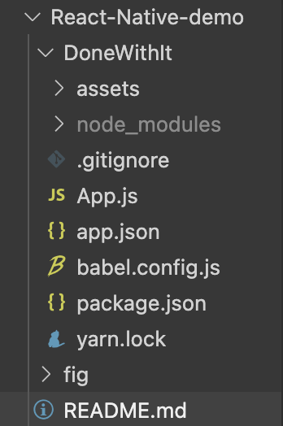
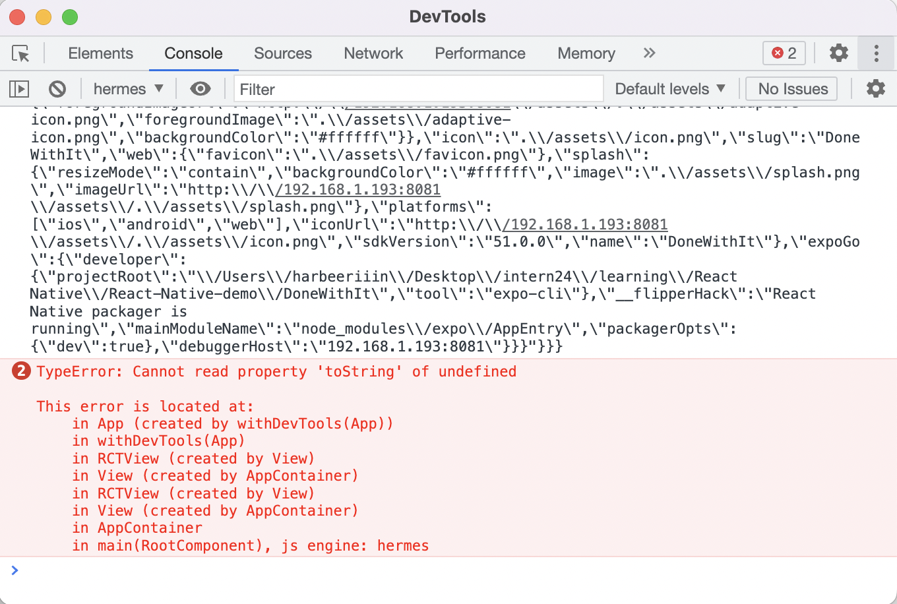
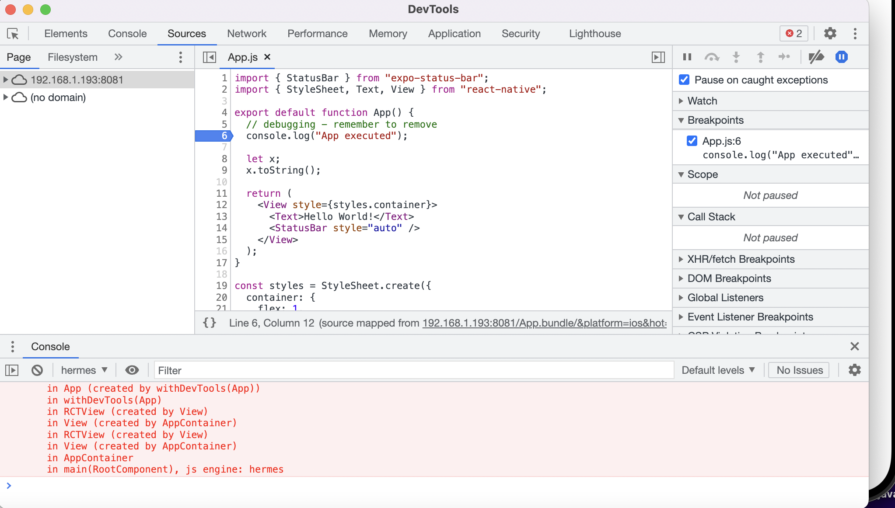
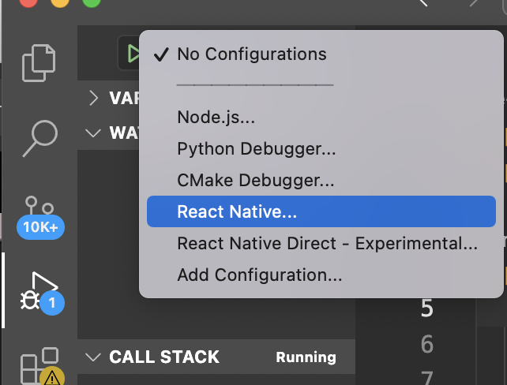

# React-Native-demo

## 1 What is React Native

- A framework for building native apps using **_JavaScript_**

- Write code in JavaScriot, share it across IOS and Android

## Expo

## Setting up the development env

1. npm install
2. expo client
3. vscode

   extensions:

   - React native tools
   - React-Native/React/Redux snippets
   - Prettier
   - meterial icon theme

## First Expo Project

`expo init DoneWithIt` -> `cd DoneWidthIt`



**use the built-in components that are provided by reactive native**

```javascript
import { StatusBar } from 'expo-status-bar';
import { StyleSheet, Text, View } from 'react-native';

export default function App() {
  return (
    // View -> UIView / etc 
    <View style={styles.container}>
  		// React Native maps these components into their native widgets
      <Text>Open up App.js to start working on your app!</Text>
      <StatusBar style="auto" />
    </View>
  );
}

const styles = StyleSheet.create({
  // Not CSS, just plain props
  container: {
    flex: 1,
    backgroundColor: '#fff',
    alignItems: 'center',
    justifyContent: 'center',
  },
});

```

+ `expo start`  ->`npx expo install react-native-web react-dom @expo/metro-runtime ` -> `npx expi start` 


## Running

+ IOS - Set up Xcode

  `command + D`

+ Android - Set up Android Studio

+ Physical phone

  shake: developer menu


## Debugging

+ console.log: remember to remove it

+ Chrome - DevTools

  



+ in VSCode - attach to packager -> create `launch.json`

  
