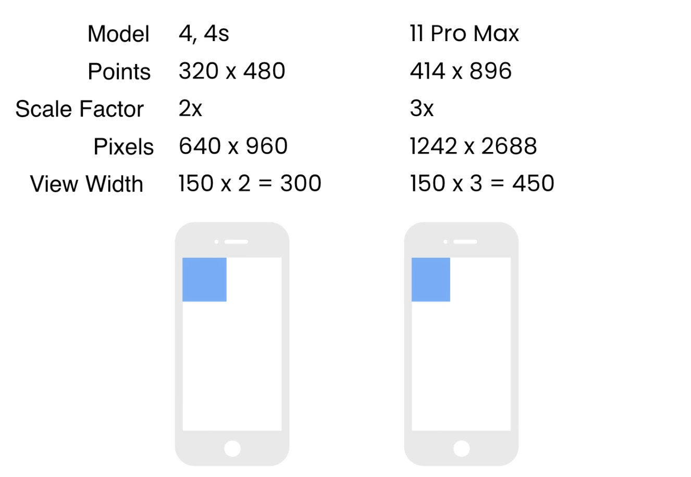

# React-Native-demo

## 1 What is React Native

- A framework for building native apps using **_JavaScript_**

- Write code in JavaScriot, share it across IOS and Android

## Expo

## Setting up the development env

1. npm install
2. expo client
3. vscode

   extensions:

   - React native tools
   - React-Native/React/Redux snippets
   - Prettier
   - meterial icon theme
   
4. install watchman

## First Expo Project

`npx create-expo-app --template` -> `cd DoneWidthIt`


**use the built-in components that are provided by reactive native**

```javascript
import { StatusBar } from 'expo-status-bar';
import { StyleSheet, Text, View } from 'react-native';

export default function App() {
  return (
    // View -> UIView / etc 
    <View style={styles.container}>
  		// React Native maps these components into their native widgets
      <Text>Open up App.js to start working on your app!</Text>
      <StatusBar style="auto" />
    </View>
  );
}

const styles = StyleSheet.create({
  // Not CSS, just plain props
  container: {
    flex: 1,
    backgroundColor: '#fff',
    alignItems: 'center',
    justifyContent: 'center',
  },
});

```

+ `expo start`  ->`npx expo install react-native-web react-dom @expo/metro-runtime ` -> `npx expi start` 


## Running

```shell
- cd DoneWithIt
- npm run android
- npm run ios
- npm run web
```


+ IOS - Set up Xcode

  `command + D`

+ Android - Set up Android Studio

+ Physical phone

  shake: developer menu


## Debugging

https://docs.expo.dev/debugging/tools/

+ console.log: remember to remove it

+ Chrome - DevTools

  


+ in VSCode - attach to packager -> create `launch.json`

  


# Components & APIs

(section1.js)

## View

> https://reactnative.dev/docs/view

`SafeAreaView`


## Text

> https://reactnative.dev/docs/text

+ always wrap text in the `<Tex/> `components

+ Truncate 
+ numberOfLines ... 
+ onPress

## Image

> https://reactnative.dev/docs/images
>
> https://reactnative.dev/docs/image
>
> https://reactnative.dev/docs/image-style-props

`<image source={require('')}/> `(reference)

+ local
+ network: 
  + obj with uri `source={{uri = ""}}`
  + manually specify the dimension for network image `width: xx, height:xx`
  + props: blurRadius, fadeDuration, resizemode

## Touchables @Deprecated

> https://reactnative.dev/docs/touchablehighlight
>
> https://reactnative.dev/docs/touchableopacity
>
> https://reactnative.dev/docs/touchablewithoutfeedback

onPress is not for `<Image>`

(use short cut)

+ TouchableHighlight
+ TouchableOpacity
+ TouchableWithoutFeedback
+ TouchableNativeFeedback


## Button

> https://reactnative.dev/docs/button


## Alert (API)

not a component

> https://reactnative.dev/docs/alert


## StyleSheet (API)

:question: Note: why `StyleSheet.create({container:{obj}})` (vs `const xxx = {{obj}}`)

​	- Prevent mispelling props -> raise error


## Platform

to solve: 

​	switch(platfrom):

​		case Android: xxx

​		case IOS: xxx

Sol:

```javascript
paddingTop: Platform.OS === 'android' ? StatusBar.currentHeight : 0 
```


---

(section2.js)

## Demension

**density-independent pixels**

​	physical pixels = DIPs ✖️ Scale Factor



width: 200 / width: "50%"

use `Dimemsions` module


# Hooks

> https://legacy.reactjs.org/docs/hooks-intro.html
>
> https://github.com/react-native-community/hooks

## Detecting Orientation CHanges

`"orientation": "portrait" -> "default"`

1. `useWindowDimensions` 

2. `useDeviceOrientation`

   `const landscape = useDeviceOrientation();`

   `height: landscape === "landscape" ? "100%" : "10%",`


# FlexBox

